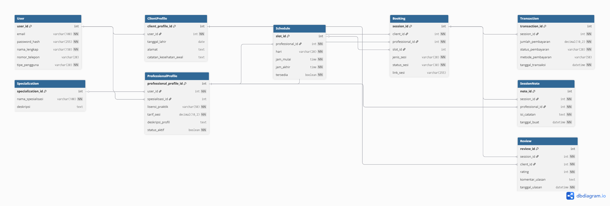

# 🌟 Aplikasi SoulCare Konsultasi Kesehatan Mental

Selamat datang di **[SoulCare]**, platform yang menghubungkan Klien dengan Profesional untuk sesi konsultasi yang aman, terstruktur, dan mudah diakses. Aplikasi ini dirancang untuk menghadirkan pengalaman konsultasi online yang nyaman, transparan, dan efisien.

---

## 🔑 Fitur Utama Akses & Otentikasi

Fitur-fitur ini memastikan pengguna dapat masuk dan mengakses konten sesuai peran mereka.

### Dua Tipe Akun
- **Klien**: Mencari, booking, dan menjalani sesi konsultasi.  
- **Profesional**: Mengatur jadwal, melihat janji temu, dan mendokumentasikan sesi.

### Sistem Login & Logout Aman
- Password dienkripsi menggunakan **password_hash**.  
- Setiap sesi pengguna dijaga keamanannya.

### Otorisasi Berbasis Peran
- Klien hanya melihat **Dashboard Klien**.  
- Profesional hanya melihat **Dashboard Profesional**.

---

## 🩺 Fitur Utama Layanan Inti (Core Service)

Fitur-fitur yang menghasilkan nilai utama dari aplikasi.

### 1. Pencarian dan Booking Sesi
- **Filter Profesional**: Cari berdasarkan Spesialisasi, Tarif, dan Ketersediaan (AvailabilitySlot).  
- **Manajemen Jadwal Profesional**: Atur dan perbarui slot waktu secara real-time.  
- **Booking Otomatis**: Sesi dibuat otomatis setelah pembayaran sukses.

### 2. Pembayaran dan Transaksi
- **Integrasi Payment Gateway**: Pembayaran instan dan aman.  
- **Status Transaksi Otomatis**: Dari "Menunggu Pembayaran" → "Terjadwal" setelah pembayaran dikonfirmasi.

### 3. Ruang Konsultasi Online
- **Sesi Video/Chat In-App**: Platform komunikasi aman dan terenkripsi.  
- **Penjadwalan Sesi**: Membuka & menutup ruang sesi sesuai `waktu_mulai` & `waktu_akhir` tabel Session.

---

## 📝 Fitur Utama Dokumentasi & Dukungan

Fitur penting untuk menjaga kualitas layanan dan pengalaman pengguna.

- **Catatan Klinis Aman (SessionNote)**: Hanya Profesional yang bisa membuat catatan sesi terenkripsi.  
- **Riwayat Sesi**: Klien melihat sesi yang telah selesai; Profesional melihat riwayat semua klien.  
- **Sistem Ulasan (Review)**: Klien bisa memberikan rating & ulasan, muncul di profil Profesional.

---

## 📊 Diagram ERD & UML

Untuk memahami struktur database dan alur aplikasi, lihat diagram berikut:

### ERD (Entity Relationship Diagram)


### UML (Use Case Diagram)


---

## 🚀 Instalasi & Penggunaan

1. Clone repository:  
```bash
git clone https://github.com/username/repo.git
